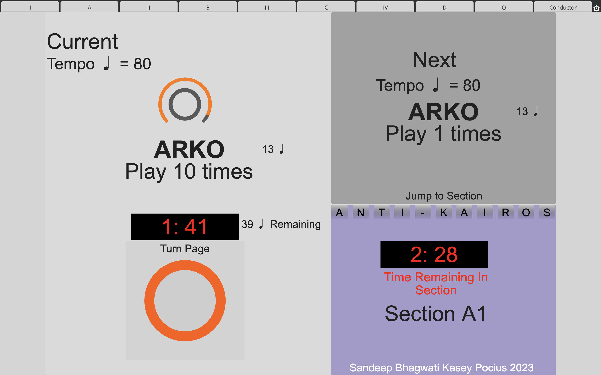
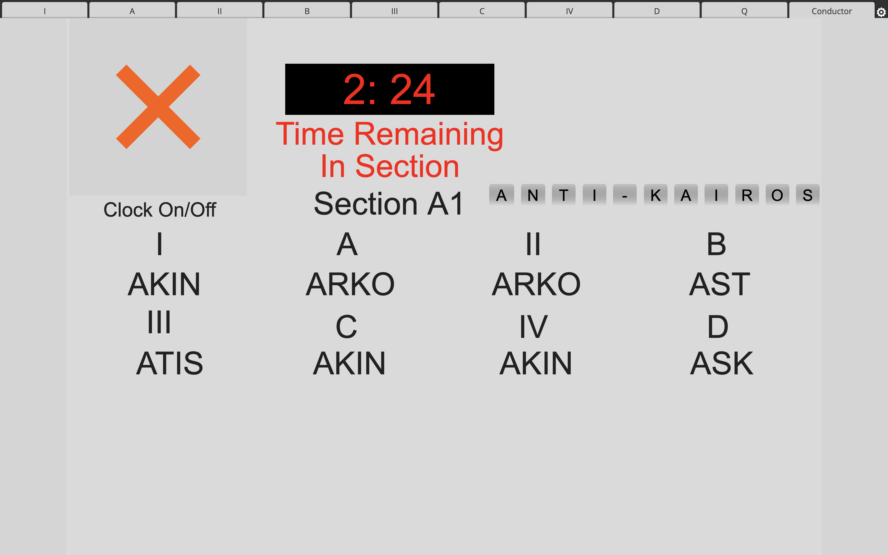

# ANTIKAIROS DIGISCORE
<h1> Reading</h1>

The digiscore for AntiKairos has two views - Performer and Conductor View.  

   

Performer View displays the current and upcoming score fragment to be played, with a button to turn the page when the performer is ready. 

Sections can be started by tapping the associated letter.

   

Conductor View displays all current fragments, and provides the ability to stop and start the performance countdown of all musicians. Sections can be started by tapping the associated letter.

 <a href="https://matralab.github.io/ANTIKAIROS_DOCS/"> Back to the main page </a>
