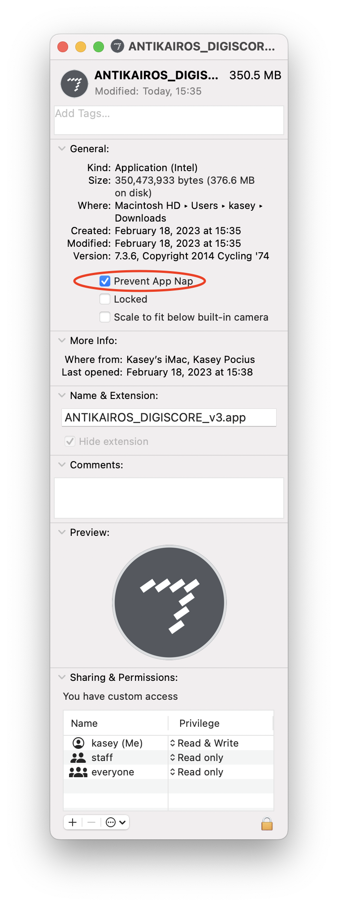
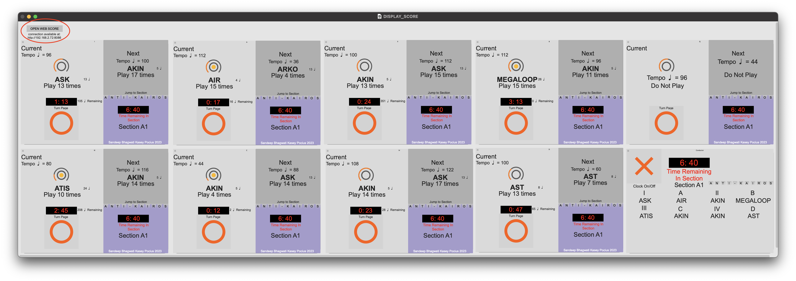
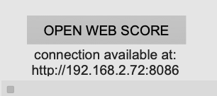

# ANTIKAIROS DIGISCORE
<h1> Setup Guide</h1>

The digiscore for ANTIKAIROS is one application with 2 parts - a web server (a computer running the application) and an arbitrary number of clients (tablets, phones, laptops etc. using their web browsers to view the score)

To get set-up, follow the steps below:

1. Ensure all the devices are on the same network. This could all be on wifi, but a wired connection for the server 

2. Open the app on the server computer. 
<a href="https://appleinsider.com/inside/macos/tips/how-to-launch-any-macos-app-even-those-not-notarized-by-apple/"> You may need to follow these steps if you are running MaxOS 10.15 or newer. </a> 

For ARM64 (M1) devices, you will need to disable app nap. This can be found by right clicking on the app -> Get Info -> "prevent app nap"

 

3. When the application opens, it will note the web address needed to connect in the top left hand corner. Note this down.

 
 

4. Enter the address in the client devices' web browsers. 

5. When prompted, enter fullscreen mode.

6.  Select your part from the tabs on the top of the interface.

 <a href="https://matralab.github.io/ANTIKAIROS_DOCS/"> Back to the main page </a>
